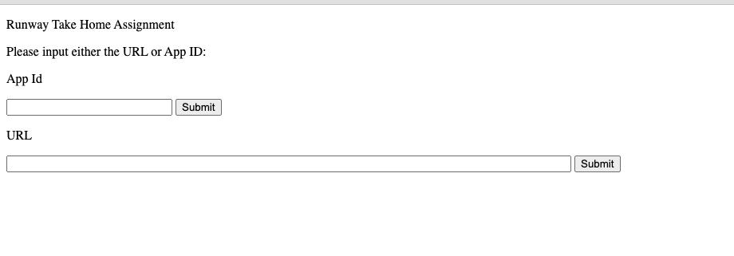

# Runway Take Home Assignment

# Overview
I have set up a FastAPI web service that can be run locally or with Docker. 
Poetry is used as the tool of choice for dependency management and packaging.
If you are interested in an applications review you can choose to either input an app id 
or a link. There is a default app id found in runway_technical/main.py file. This is what is used 

## Set Up

### Poetry

Documentation around Poetry can be found here: https://python-poetry.org/docs/basic-usage/

To set up Poetry run: 
```
curl -sSL https://install.python-poetry.org | python3 -

Or if you want to define the $POETRY_HOME environment variable:

curl -sSL https://install.python-poetry.org | POETRY_HOME=/etc/poetry python3 -


poetry check
poetry install
poetry shell
```


## Running the web service

### Docker

To run the web app through docker, start the docker service and create the container via these commands:
```
docker build -t runway_image .  
docker run -d --name runway_technical -p 80:80 runway_image
```

To get the csv file that is continuously updated you can extract it by:

```
sudo docker container ls 
sudo docker cp {CONTAINER ID}:/code/reviews.csv ~/{PATH}
```

## Alternative

Alternatively you can run this command:
```
uvicorn runway_technical.main:app --reload
```

## Using the service

The web service should look like this:



Submit an app ID or URL. Once you hit submit a csv should download a few seconds later.
If you do not input anything it will default to DEFAULT_APP_ID found in the runway_technical/main.py file:

```
DEFAULT_APP_ID: str = "447188370"
```